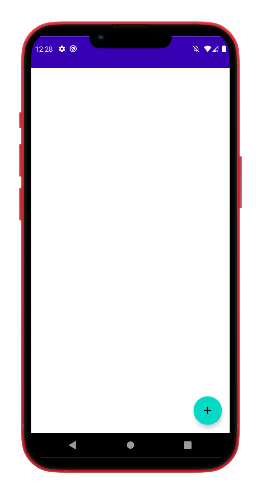
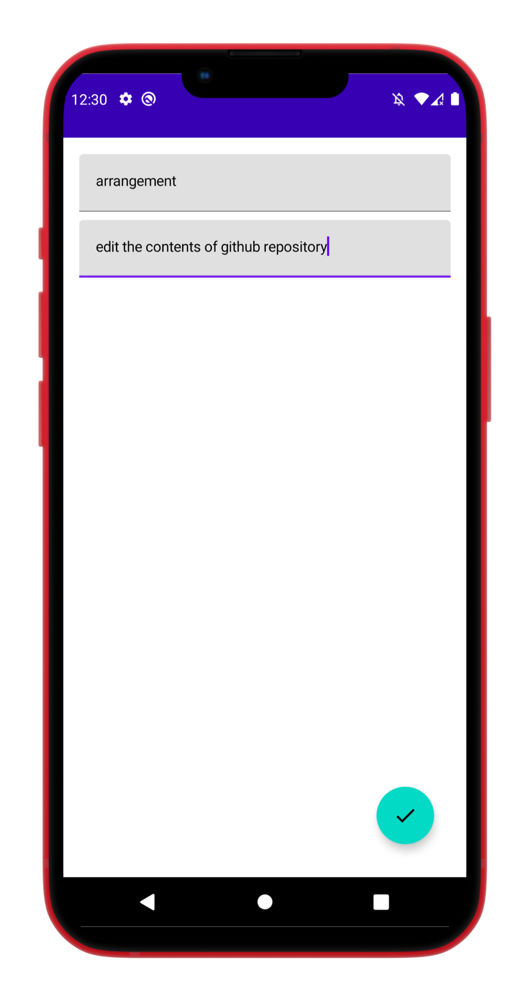
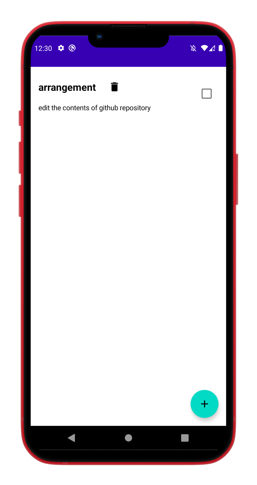
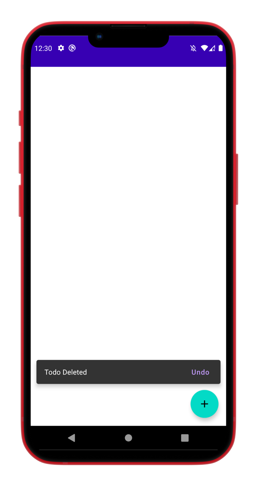

# ToDoListApp
 To Do List App with MVVM-Jetpack Compose Element-di-Repository
 
 Build an app with Kotlin and Android Studio, Designed UI with Jetpack Compose
 Implemented MVVM architecture to comply with the separation of concerns
 Used Room local SQL database to provide offline support
 Integrated lifecycle tools such as LiveData to avoid memory leaks
 
 
 
 

  
  
  
  
 

